# NSEE India — Architecture & Flow Diagrams

> Single source of truth for system flows. Diagrams use Mermaid (renders on GitHub/GitLab/VS Code).
> Version 1.1 · October 2026 · Owner: Dev Team

## Table of Contents

1. [Student End-to-End Journey](#1-student-end-to-end-journey)
2. [Hexagonal Request Flow](#2-hexagonal-request-flow)
3. [Auth Flow](#3-auth-flow)
4. [USID Generation](#4-usid-generation)
5. [Maker–Checker Approval](#5-makerchecker-approval)
6. [Payment Flow](#6-payment-flow)
7. [Exam Session Flow](#7-exam-session-flow)
8. [Sprint Development Loop](#8-sprint-development-loop)
9. [Release & Deployment](#9-release--deployment)
10. [Feature Flag Flow](#10-feature-flag-flow)
11. [Role Hierarchy](#11-role-hierarchy)
12. [Database ER](#12-database-er)
13. [Architecture Layers](#13-architecture-layers)

---

## 1. Student End-to-End Journey

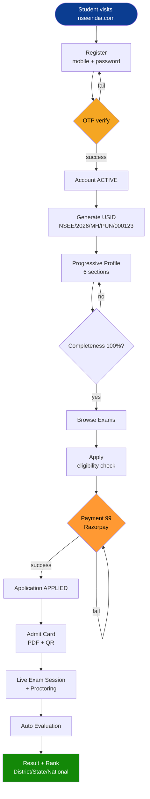

### Stage Reference

| # | Stage | Trigger | Tables | Endpoint |
|---|-------|---------|--------|----------|
| 1 | Register | Mobile + password | `users`, `otp` | `POST /auth/register` |
| 1b | Verify OTP | 6-digit code | `otp`, `users` | `POST /auth/verify-otp` |
| 2 | USID issue | Profile start | `students`, `usid_sequence` | `POST /students/register` |
| 3 | Profile | Section-wise save | `student_profiles`, `profile_documents` | `PATCH /profiles/me` |
| 4 | Apply | Eligibility pass | `exam_applications` | `POST /applications` |
| 5 | Pay | 99 INR order | `payments`, `payment_webhooks` | `POST /payments/order` |
| 6 | Admit card | Release date reached | `admit_cards` | `GET /admit-cards/me` |
| 7 | Exam | Start button | `exam_sessions`, `session_responses`, `proctoring_events` | `POST /sessions/start` |
| 8 | Result | Admin publishes | `results`, `ranks` | `GET /results/me` |

---

## 2. Hexagonal Request Flow

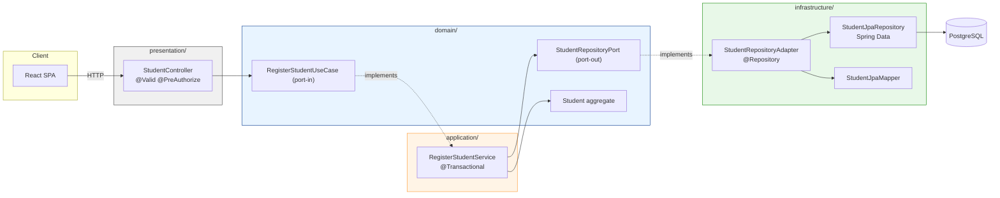

**Dependency rule (ArchUnit-enforced):**

```
presentation -> application -> domain
                    ^
              infrastructure  (implements domain ports)
```

`domain/` imports nothing but `java.*`.

---

## 3. Auth Flow

### 3a. Register + OTP + JWT

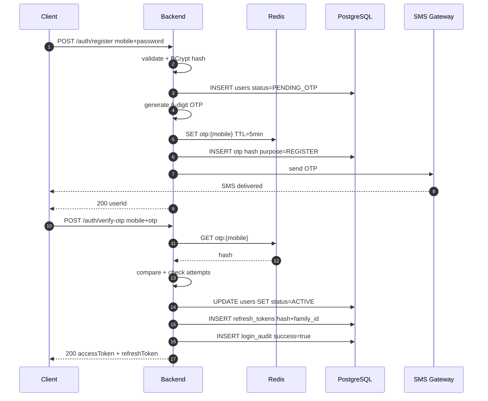

### 3b. JWT Refresh (Rotating)

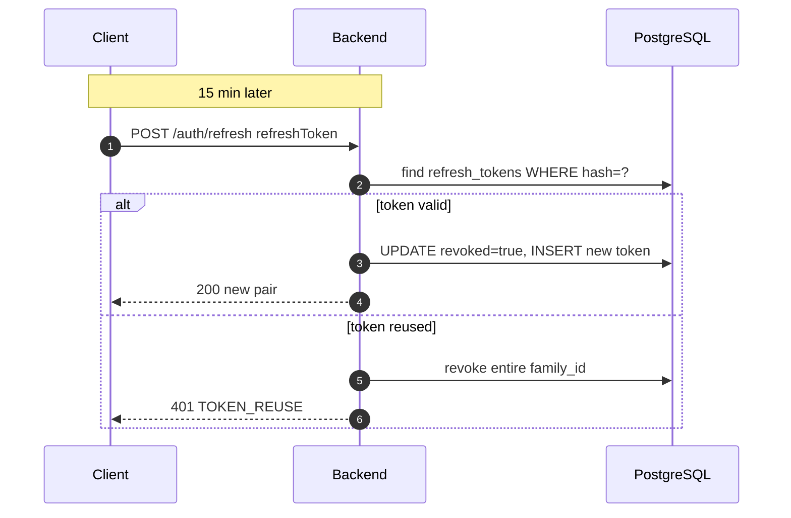

**Rate limits (Redis + Bucket4j):**
- 3 OTP requests / mobile / 10 min
- 5 verify attempts / OTP (then invalidate)
- 10 login attempts / IP / min

---

## 4. USID Generation

**Format:** `NSEE/YYYY/STATE/DIST/000123`

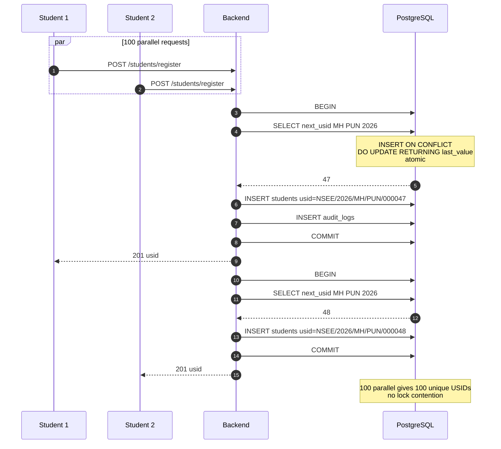

**Atomic function:**

```sql
CREATE OR REPLACE FUNCTION next_usid(p_state VARCHAR(4), p_district VARCHAR(8), p_year SMALLINT)
RETURNS TEXT AS $$
DECLARE v_seq INTEGER;
BEGIN
    INSERT INTO usid_sequence (state_code, district_code, year, last_value)
    VALUES (p_state, p_district, p_year, 1)
    ON CONFLICT (state_code, district_code, year)
    DO UPDATE SET last_value = usid_sequence.last_value + 1
    RETURNING last_value INTO v_seq;

    RETURN format('NSEE/%s/%s/%s/%s', p_year, p_state, p_district, lpad(v_seq::text, 6, '0'));
END;
$$ LANGUAGE plpgsql;
```

---

## 5. Maker–Checker Approval

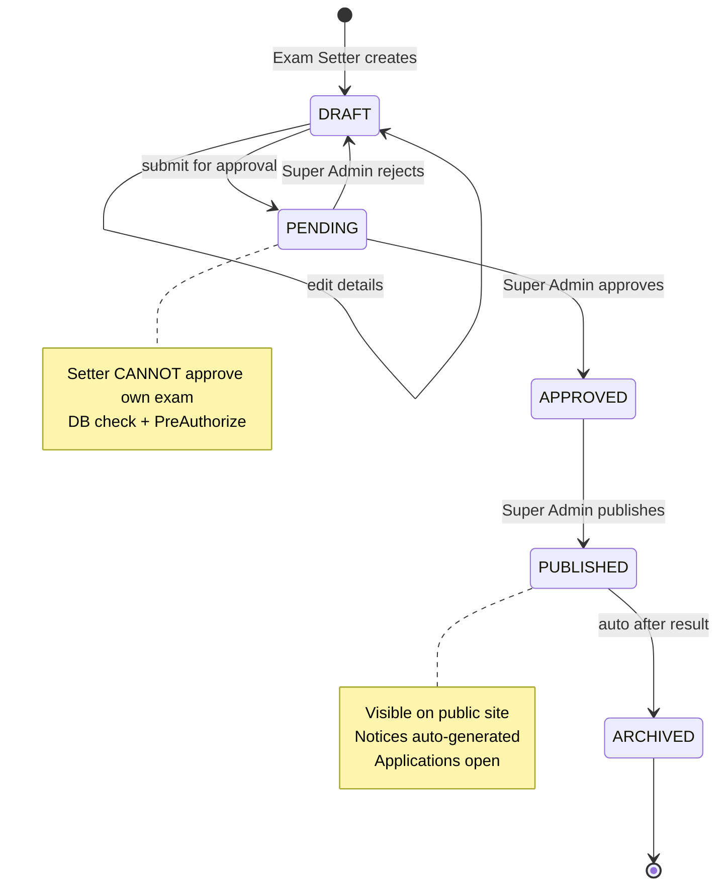

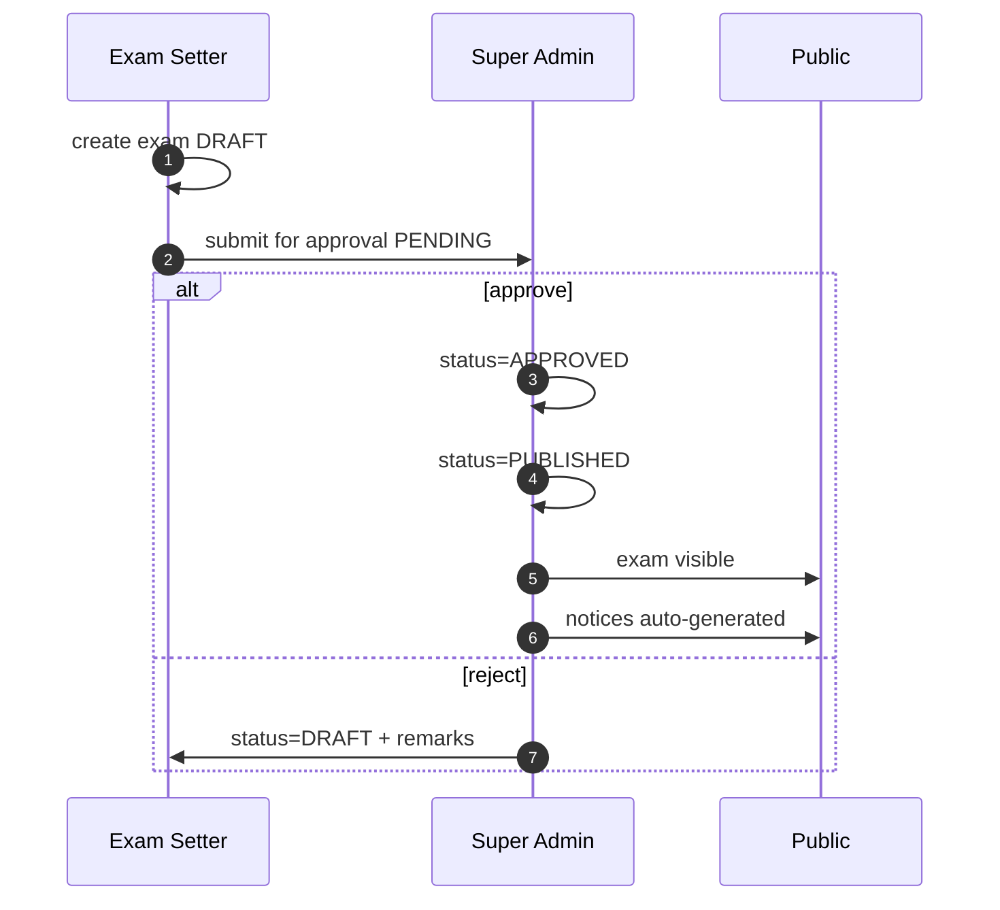

Every transition writes to `exam_approvals`, `exam_audit`, and `audit_logs`.

---

## 6. Payment Flow

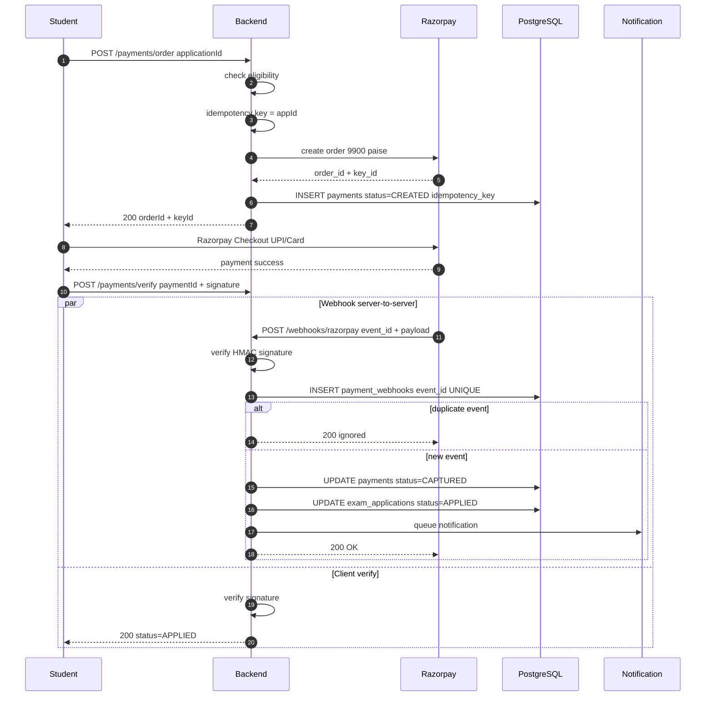

**Idempotency guarantees:**
- `payments.idempotency_key` UNIQUE — double-tap cannot create 2 orders
- `payment_webhooks.event_id` UNIQUE — Razorpay retry cannot double-apply
- Webhook handler is transactional + uses `ON CONFLICT DO NOTHING`

**Daily reconciliation:**

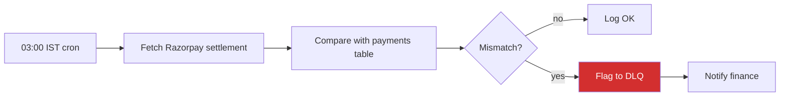

---

## 7. Exam Session Flow

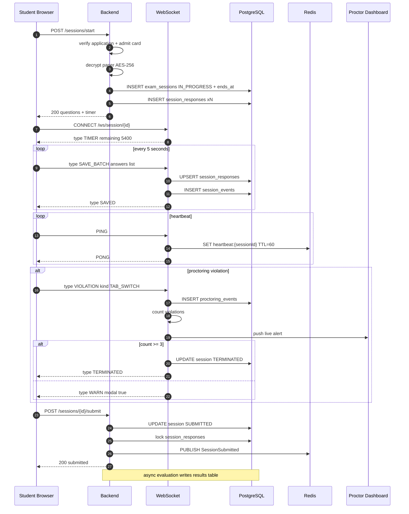

**Failure handling:**
- Browser crash — reconnect WS, resume from server state (Redis holds last 60s)
- Network drop — client buffers locally, resends on reconnect
- Server restart — session state in Postgres, heartbeat resumes

---

## 8. Sprint Development Loop

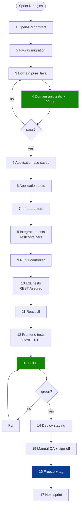

**Gate:** Step N+1 blocked until step N passes. Enforced by branch protection + CI.

---

## 9. Release & Deployment

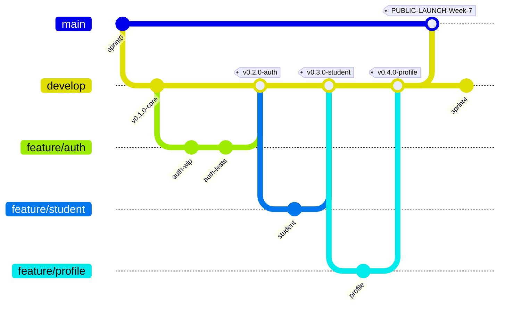

### Environment Pipeline

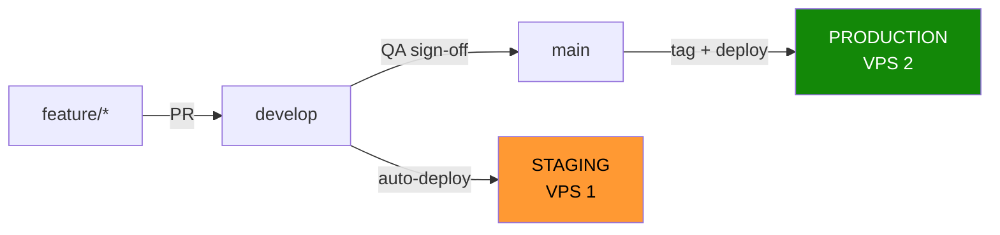

### CI on PR to develop

```
1. mvn spotless:check
2. mvn compile
3. mvn test                    coverage < 85% = FAIL
4. mvn verify                  Testcontainers
5. mvn failsafe:integration-test
6. npm run lint
7. npm run test
8. npm run build
9. gitleaks detect             secret scan
```

### CD on push to main

```
1. Build multi-stage Docker image
2. Push to ghcr.io/nsee/api:sha-<short>
3. SSH to VPS
4. docker compose pull
5. docker compose up -d
6. Flyway migrations run on startup
7. healthcheck /actuator/health returns 200 OK
8. If healthcheck fails -> auto-rollback to previous image
```

### Release Tags

| Tag | Sprint |
|-----|--------|
| `v0.1.0-core` | Sprint 0 |
| `v0.2.0-auth` | Sprint 1 |
| `v0.3.0-student` | Sprint 2 |
| `v0.4.0-profile` | Sprint 3 — **PUBLIC LAUNCH (Week 7)** |
| `v0.5.0-geography` | Sprint 4 |
| `v0.6.0-notice` | Sprint 5 |
| `v0.7.0-query` | Sprint 6 |
| `v0.8.0-exam` | Sprint 7 |
| ... | ... |
| `v1.0.0-production` | Sprint 20 |

---

## 10. Feature Flag Flow

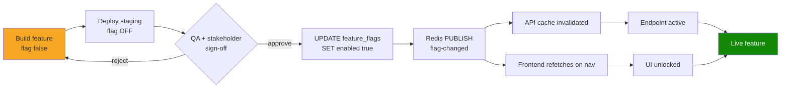

**Backend gate:**

```java
@GetMapping("/applications")
@PreAuthorize("@flags.isEnabled('application')")
public List<ApplicationDto> list() { ... }
```

**Frontend gate:**

```tsx
{flags.application ? <ApplyButton /> : <ComingSoonBadge />}
```

---

## 11. Role Hierarchy

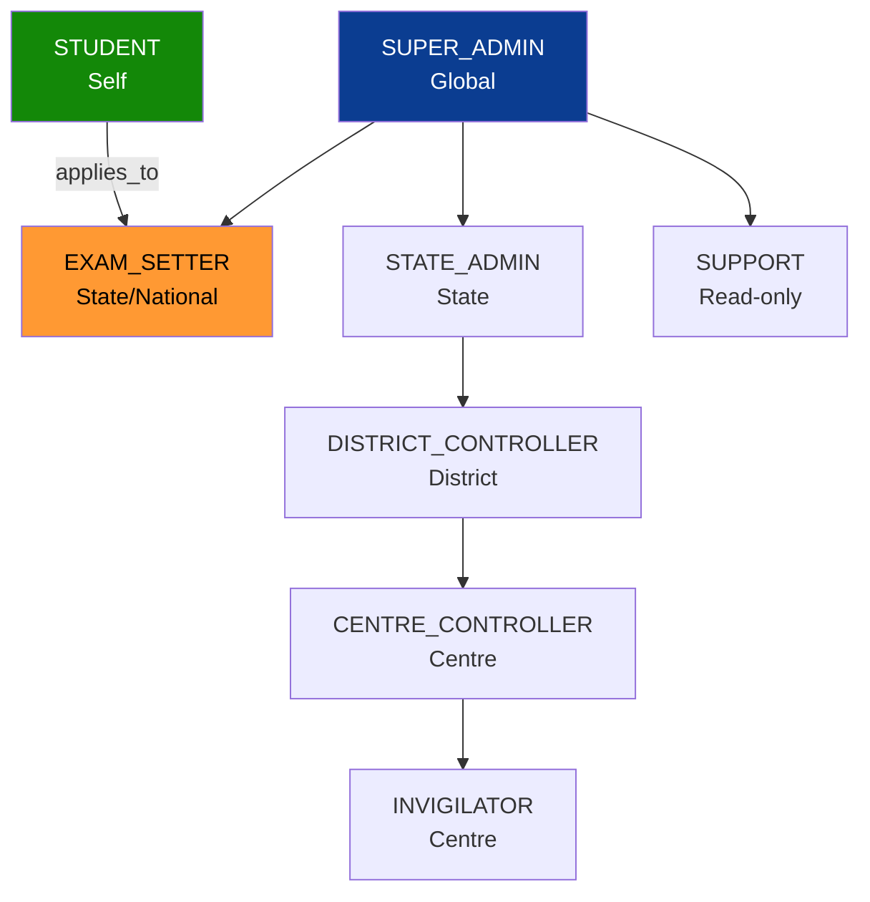

| Role | Scope | Key Permissions |
|------|-------|-----------------|
| `SUPER_ADMIN` | Global | Create admins, approve exams/notices, global config |
| `EXAM_SETTER` | State/National | Create exams, question bank, generate papers, publish |
| `STATE_ADMIN` | State | Manage districts, state reports |
| `DISTRICT_CONTROLLER` | District | Add centres, assign centre controllers |
| `CENTRE_CONTROLLER` | Centre | Conduct offline exam, verify students, unlock PCs |
| `INVIGILATOR` | Centre/Remote | Monitor live exam, warn, terminate |
| `STUDENT` | Self | Register, profile, apply, pay, exam, result |
| `SUPPORT` | Read-only | Queries, grievances, audit |

---

## 12. Database ER

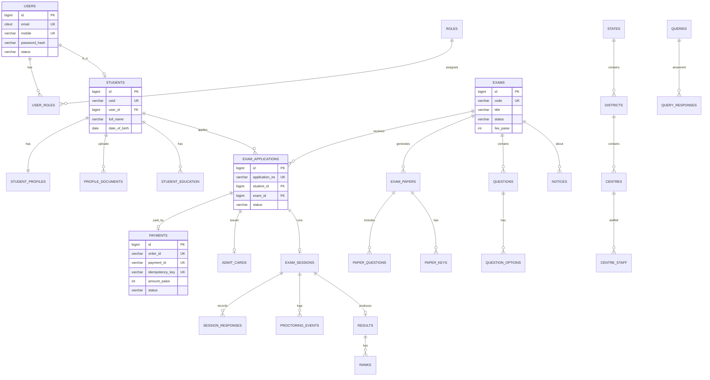

Full DDL: see `nsee-backend/src/main/resources/db/migration/`.

---

## 13. Architecture Layers

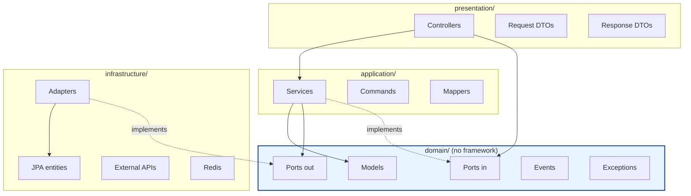

**Rule:** arrows only point **inward** toward `domain/`. ArchUnit test fails the build if violated.

### Feature Folder Template

```
features/exam/
├── domain/
│   ├── model/          # Aggregate roots, entities, VOs
│   ├── event/          # Domain events
│   ├── exception/      # Domain exceptions
│   └── port/
│       ├── in/         # Use case interfaces
│       └── out/        # Repository/external interfaces
├── application/
│   ├── service/        # Implements use cases
│   ├── dto/            # Commands, responses, mappers
│   └── event/          # Event publishers
├── infrastructure/
│   ├── persistence/    # JPA entities, repositories, adapters
│   ├── messaging/      # Redis/queue adapters
│   └── external/       # Third-party adapters
├── presentation/
│   ├── ExamController.java
│   ├── request/
│   └── response/
└── ExamModuleConfig.java
```

---

## Appendix — Rendering the Diagrams

### On GitHub / GitLab
Commit this file as `architecture.md`. Mermaid renders automatically in the Markdown view.

### Locally (PNG/SVG export)
```bash
npm install -g @mermaid-js/mermaid-cli

# extract each block to its own .mmd file, then:
mmdc -i docs/diagrams/01-journey.mmd -o docs/diagrams/01-journey.svg
```

### CI auto-render
```yaml
- name: Render diagrams
  run: |
    npm i -g @mermaid-js/mermaid-cli
    for f in docs/diagrams/*.mmd; do
      mmdc -i "$f" -o "${f%.mmd}.svg"
    done
```

### VS Code
Install **"Markdown Preview Mermaid Support"** → `Ctrl+Shift+V` renders live.

---

*End of document. Update version on every change.*
